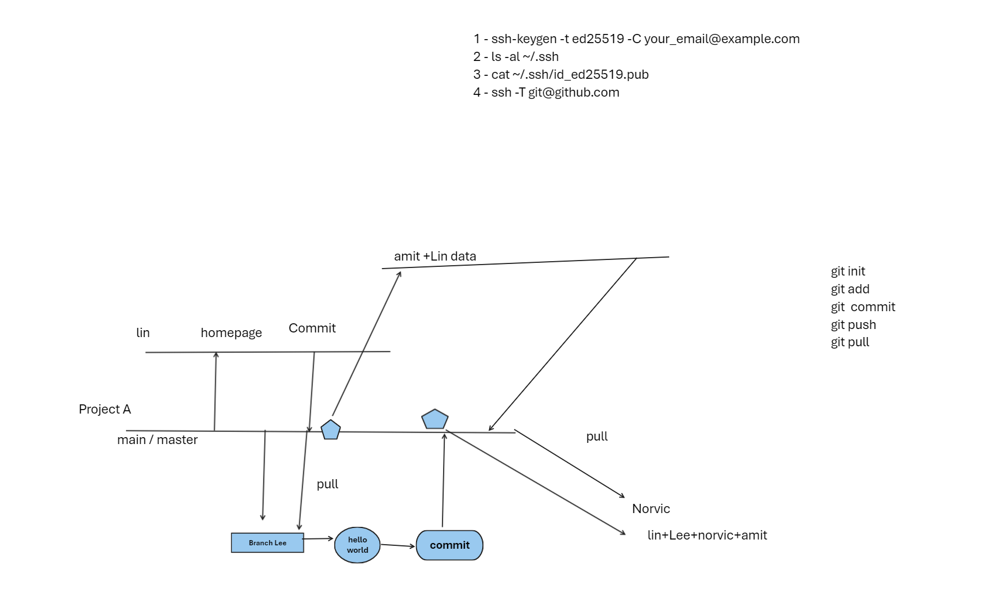

# Day 01 Notes


### Download and install 
- git
- vscode
- create AWS Account

### Hands on

- create ssh key for git
- publish key to github
- Check github connectivity
- create first repo
- clone a repo 
- create your first file


### Commands 

#### Create ssh key and validate connection

``` 
ssh-keygen -t ed25519 -C "your_email@example.com 

# check keys
ls -al ~/.ssh

# Copy keys
cat ~/.ssh/id_ed25519.pub


# check connectivity
 ssh -T git@github.com

```

#### Clone repo

```
git clone https://github.com/anuvindhs/TechWithAnuvindh.git

```

Notes



