# Day 03 Notes  EC2 instance host ubantu default page and replce the homepage 
 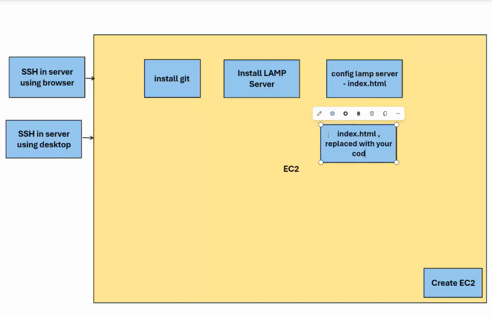

### 1. create a VM instance in AWS 
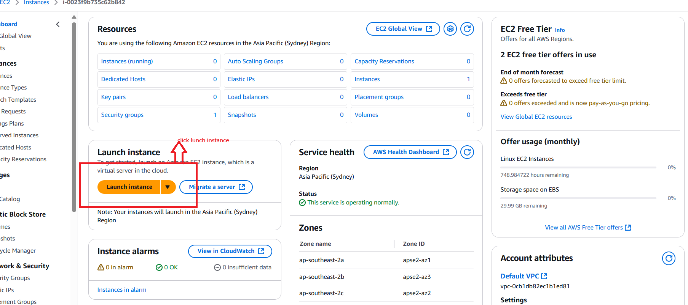 

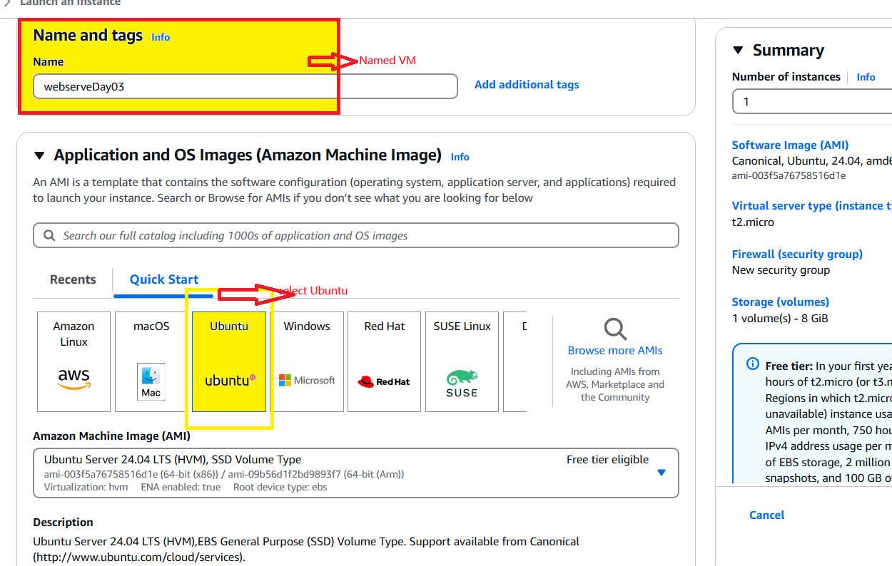 
 Named the server as 'webseverDay03',and select OS 'ubuntu' 

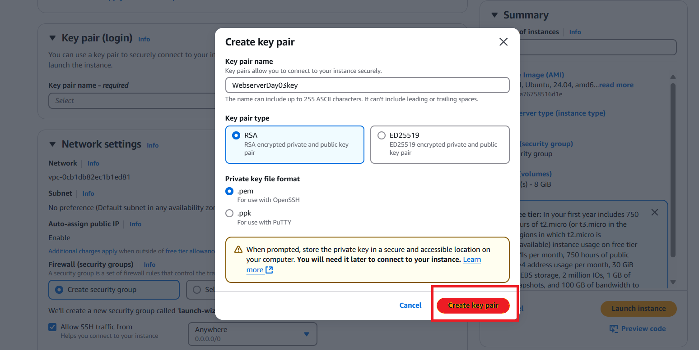
Create key pairs 

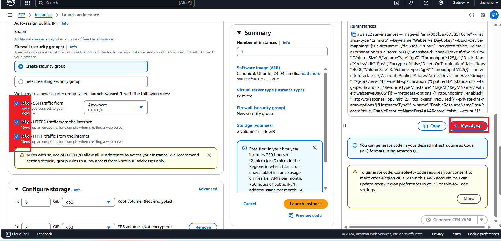
Allow SSH ,HTTP ,HTTPS traffic 

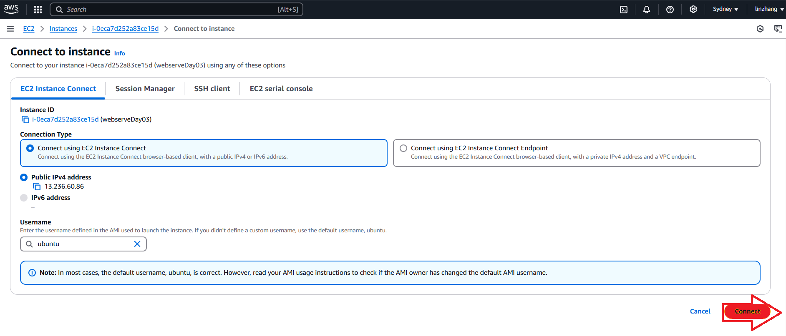
Connect to the VM 

### 2. install git in AWS instance -vm server
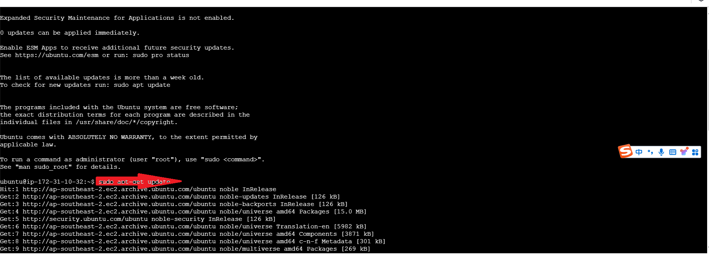
sudo apt-get update

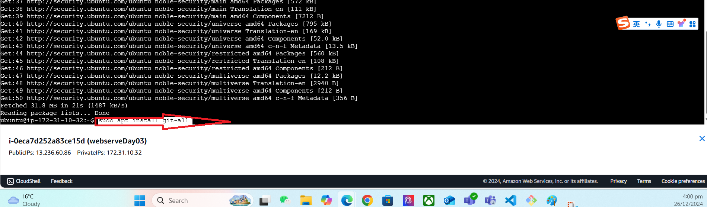
sudo apt install git-all

### 3. install LAMP server 
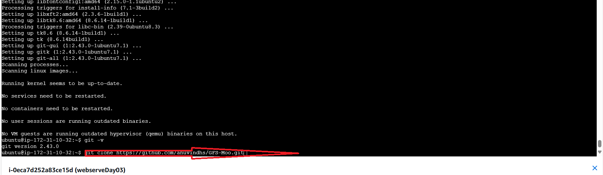
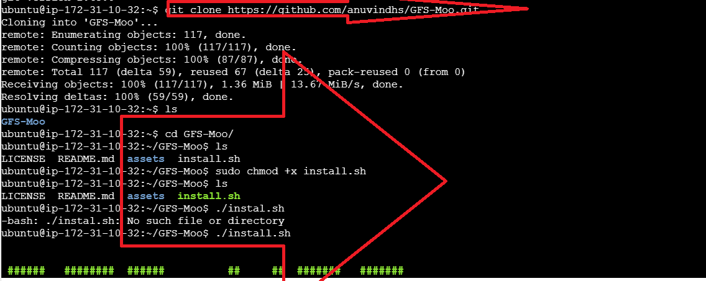
git clone https://github.com/anuvindhs/GFS-Moo git
The GFS-Moo folder contains an automation script designed to help install and configure a set of services on Linux servers, including the LAMP stack 

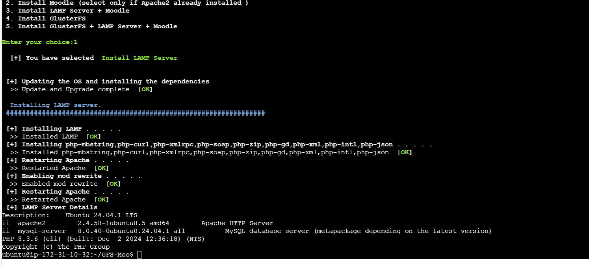
 install lamp server 

### 4. config -index.html within lamp server
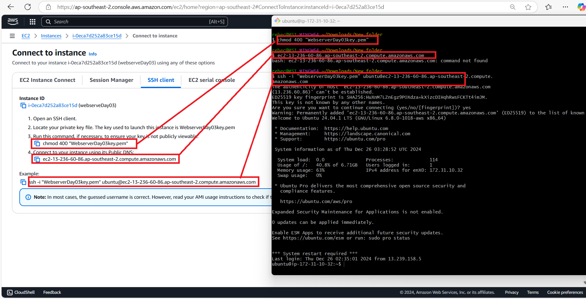
Using SSH connect to VM 

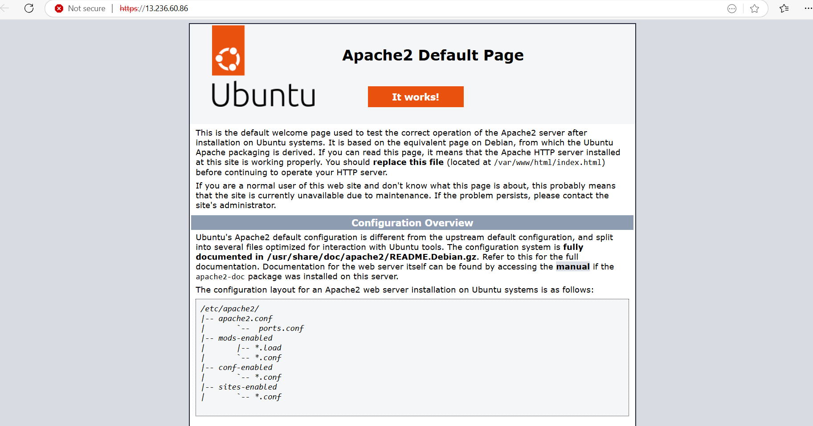
https://13.236.60.86/ OR click Instances -13.236.60.86 | open address , the homepage apprears 
 

### 5. test by a new index.html 
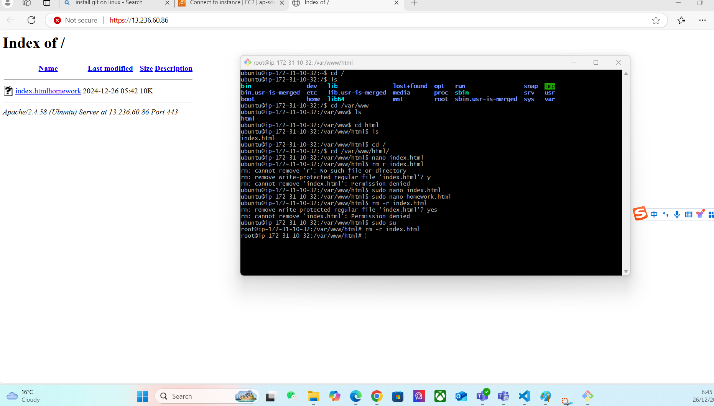
Reomved the original index.html 

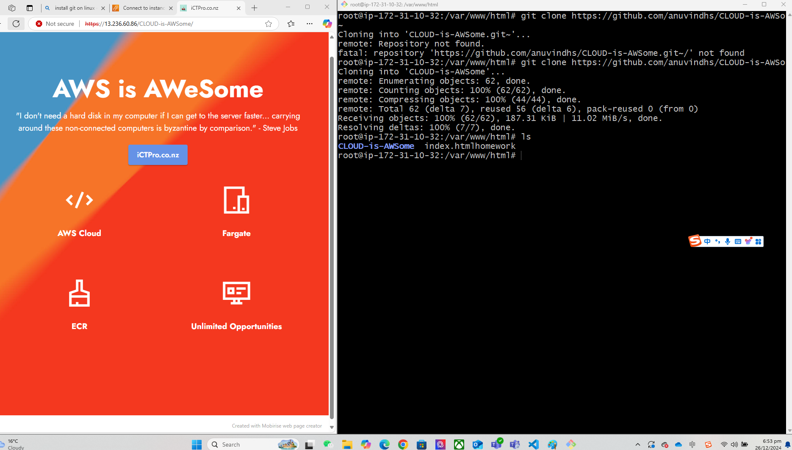
Homepage replaced 

