# 3-Tier Architecture

## 1. Tiers

### 🎨 Presentation Tier  
Handles user interactions, such as web pages and app interfaces.
#### Technology Stack :Technologies :HTML、CSS、JavaScript（React、Vue）、Flutter、Android/iOS U

### 🖥️ Logic Tier  
Processes business logic, including calculations, validation, and APIs.
#### Technology Stack :Java（Spring Boot）、Python（Django、Flask）、Node.js（Express）

### 💾 Data Tier 
Stores data, such as databases. 
#### Technology Stack :MySQL、PostgreSQL、MongoDB、Redis

## 2. Data Flow  
User action → Logic tier processing → Data retrieval from database → Logic tier response → Display to user.

 

 

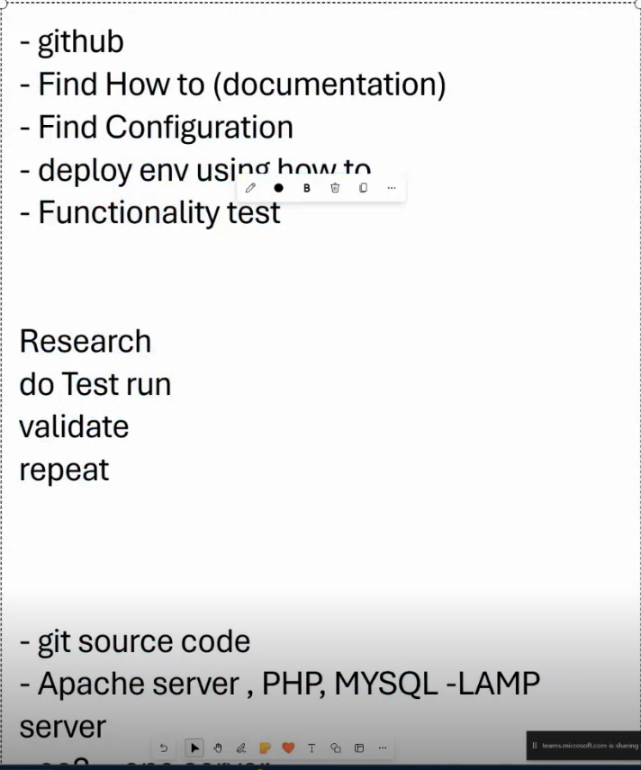  
 basic knowledge   

# Install WordPress -host in EC2 instance （Ubuntu ）

## 1. Launch instance in EC2 
 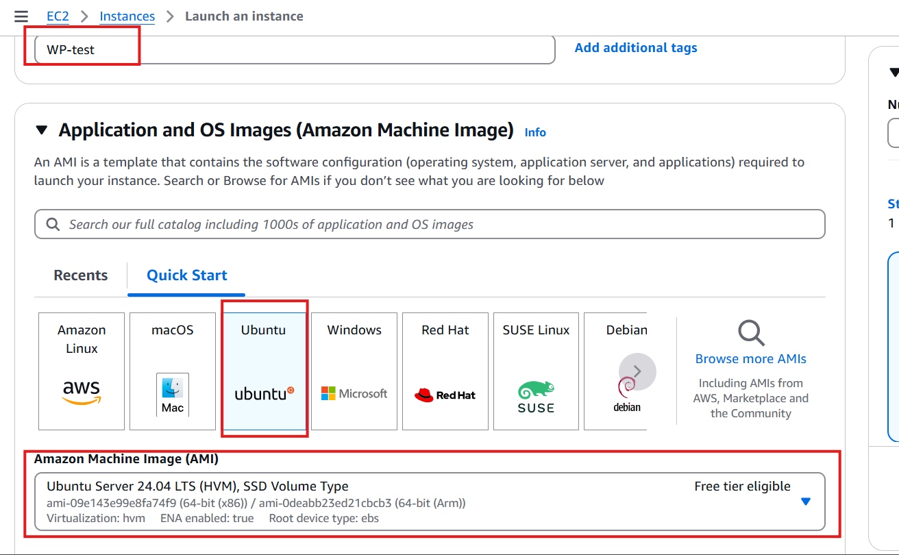
Select Ubuntu 24.04   
   
 
Using old .pem key，or create a new key paire

 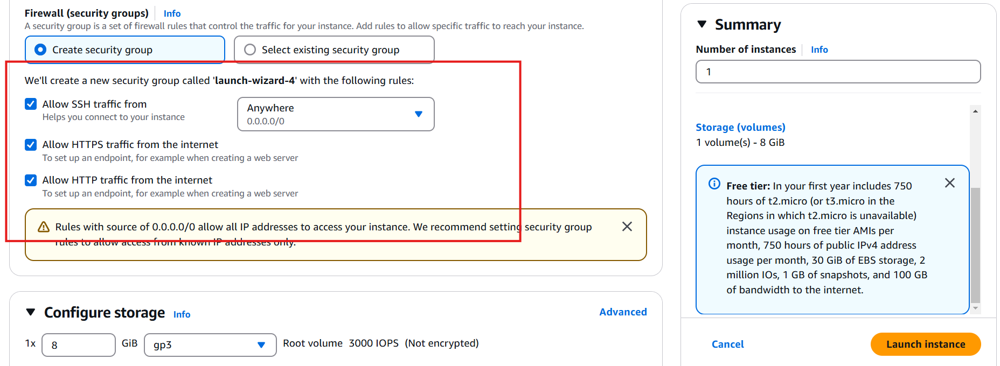
Allow SSH ,HTTPS ,HTTP traffic as a new security group 'launch-wizard-4'

 Connect to the instance   

Public ip :3.27.146.140 ,if paste in webbrower ,will display Ubuntu default page 
 

## 2. LAMP（Linux + Apache + MySQL + PHP ) 
(1) access git bash 

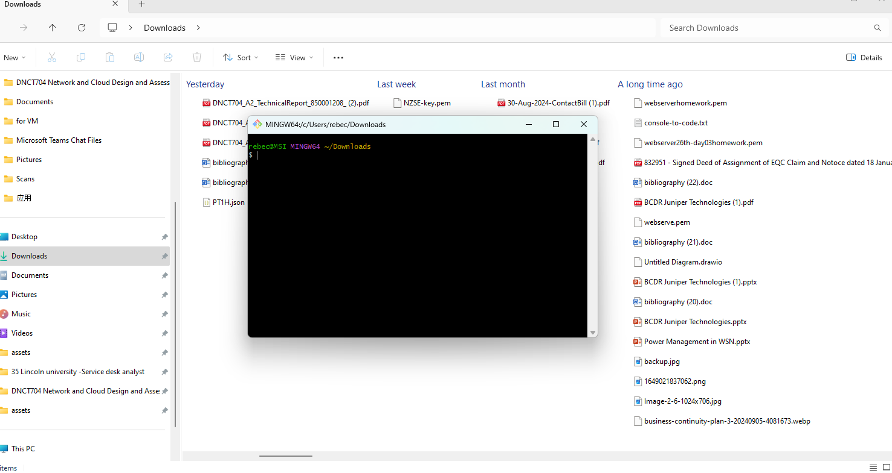  

Shift + right-click (in an empty space) allows we to open Git Bash in Windows File Explore

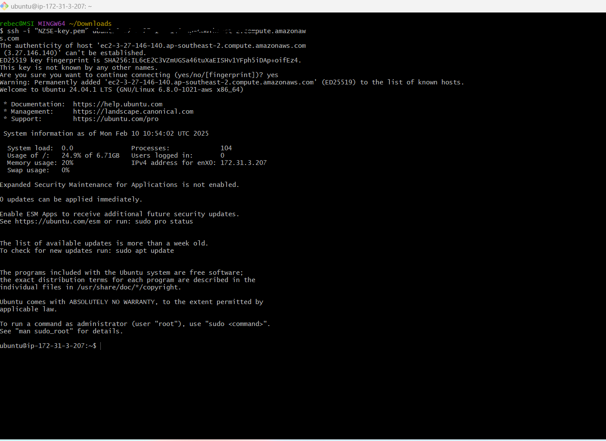  

Use SSH to connect to your Ubuntu system (EC2 instance) using the .pem key.

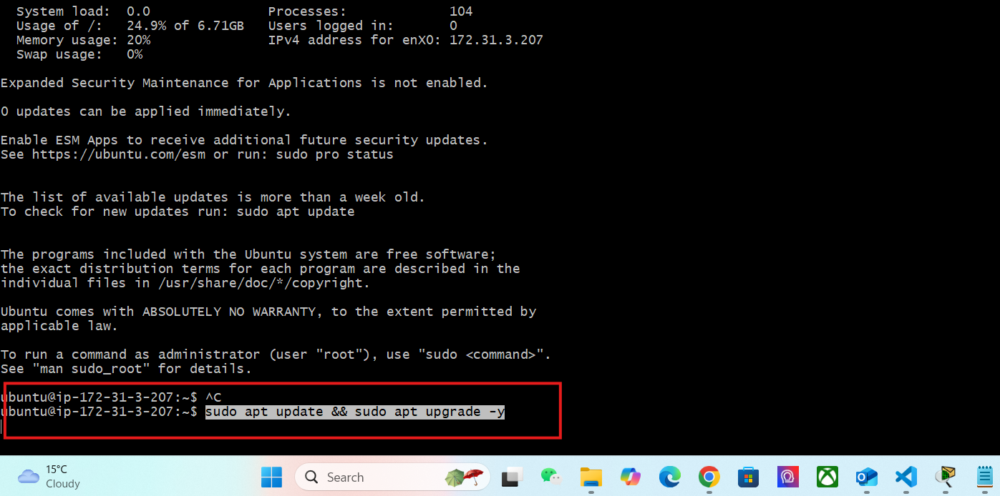  

sudo apt update refer to 'Update the package index.'  

sudo apt upgrade -y refer to' Upgrade the installed packages to their latest versions ' 
 

### (2) Apache
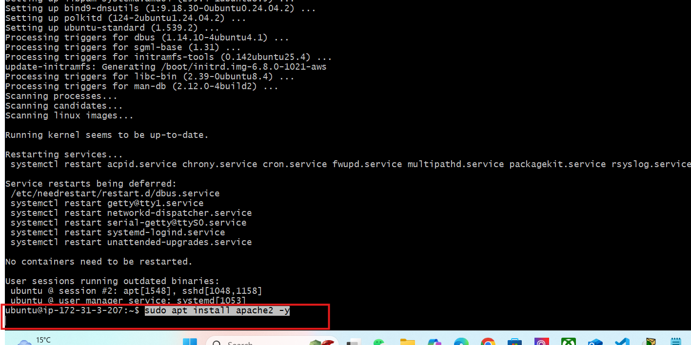   

sudo apt install apache2 -y refer to 'install Apache web server'

### (3) PHP
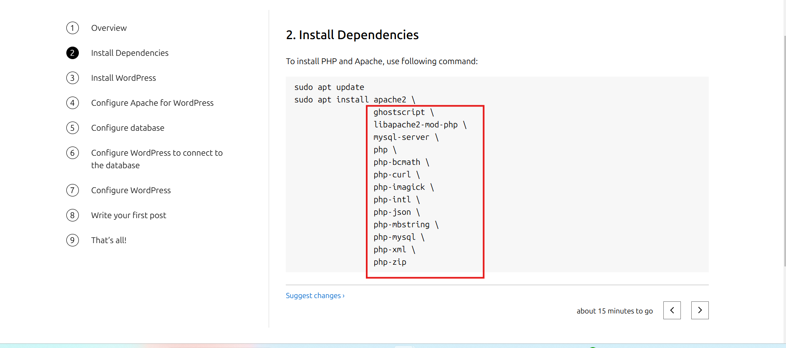   

Install PHP 

### (4)  MySQL
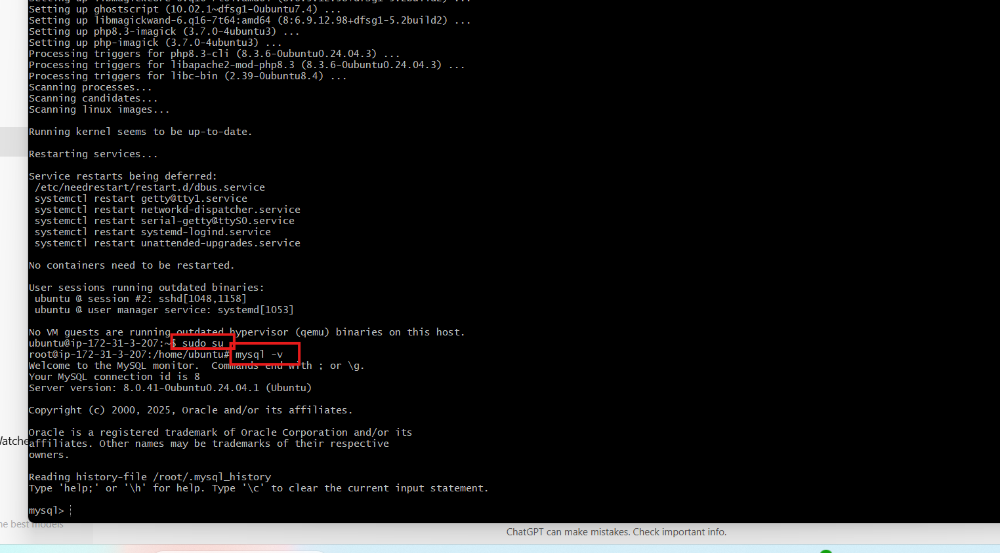   

 sudo su 'Switch to the root user.'  

 mysql -v ' Show the MySQL client version'

### (5) Download and install WordPress
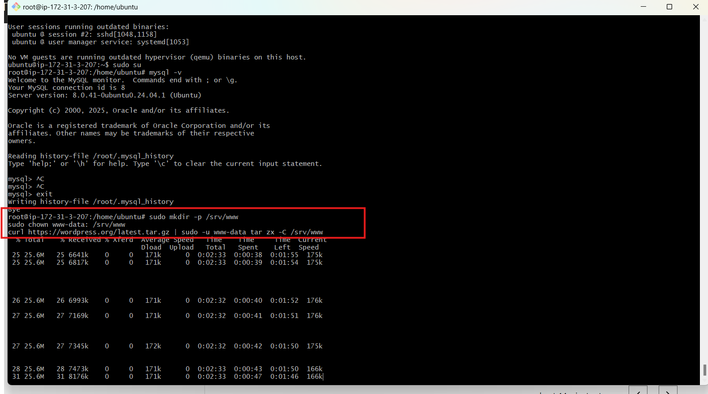 

#### sudo mkdir -p /srv/www refer to 'Creates the directory /srv/www if it doesn't already exist.'
sudo chown www-data: /srv/www refer to 'Changes the ownership of the /srv/www directory to the user www-data'   

curl https://wordpress.org/latest.tar.gz | sudo -u www-data tar zx -C /srv/www refer to 'Downloads the latest WordPress tarball and extracts it to /srv/www using the www-data user.'  

### (6)  Configure Apache for WordPress
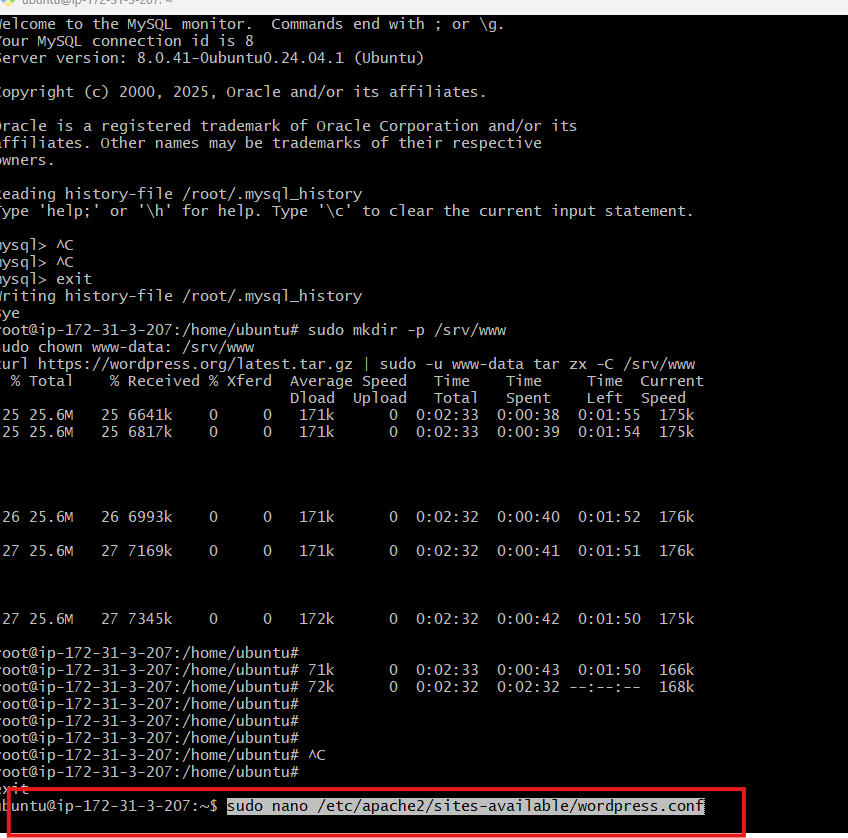   

sudo nano /etc/apache2/sites-available/wordpress.conf  refer to 'opens the wordpress.conf file in the Nano text editor, allowing you to edit the Apache configuration file'

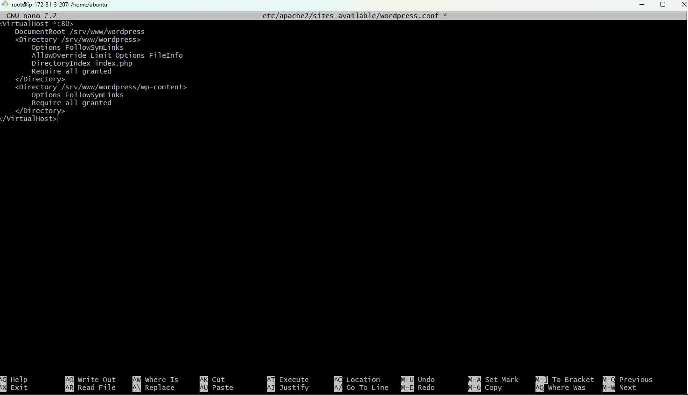   

add the code to the file 

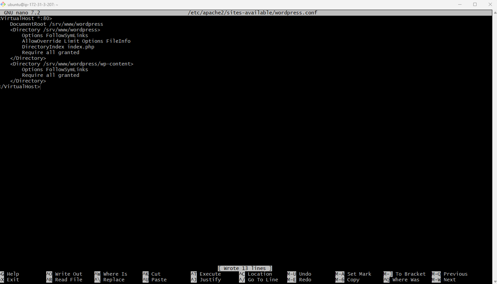   

ctrl +o, write out ,and enter ,and ctrl+x exit 

   

sudo a2ensite wordpress 'Enable the site with:'  

sudo a2enmod rewrite 'Enable URL rewriting with:'  

## 3. stop/start a instance in aws
  aws ec2 stop-instances --instance-ids  

  aws ec2 start-instances --instance-ids   

