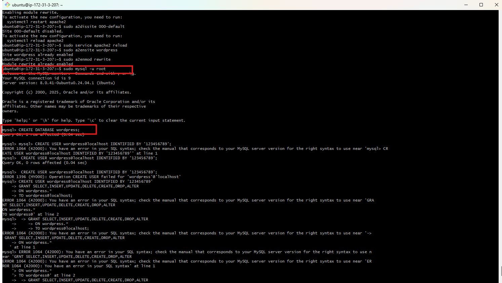
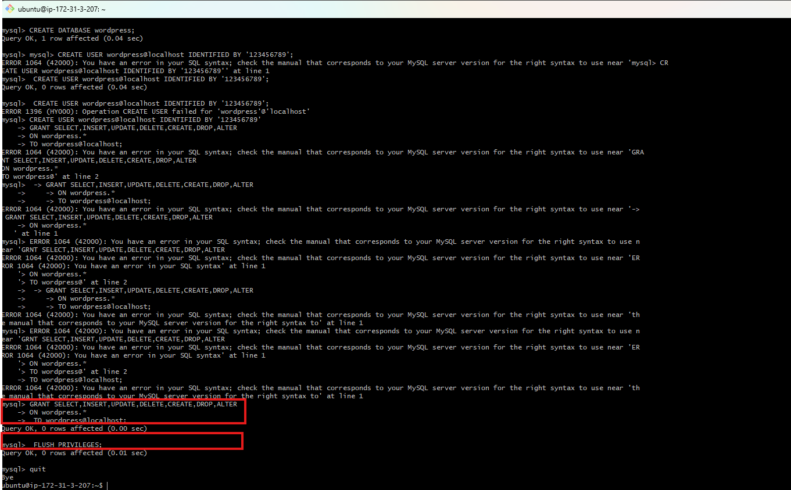
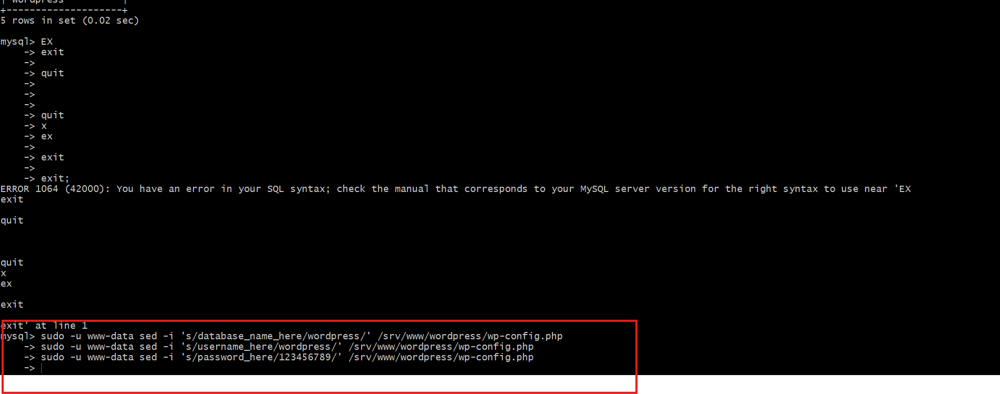
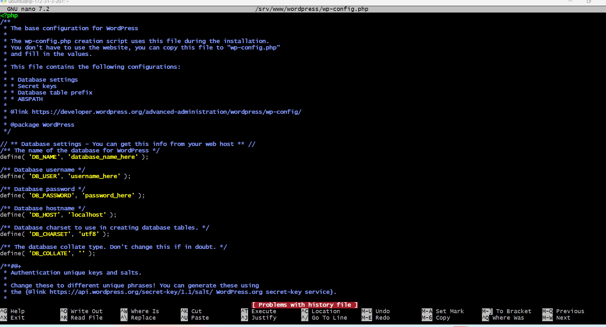
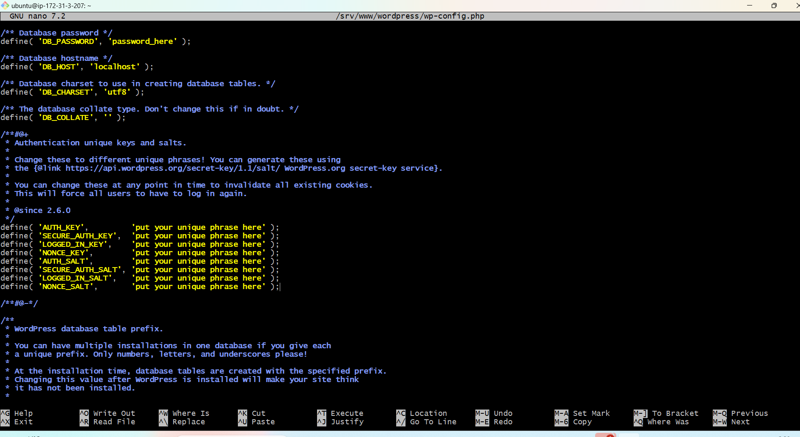
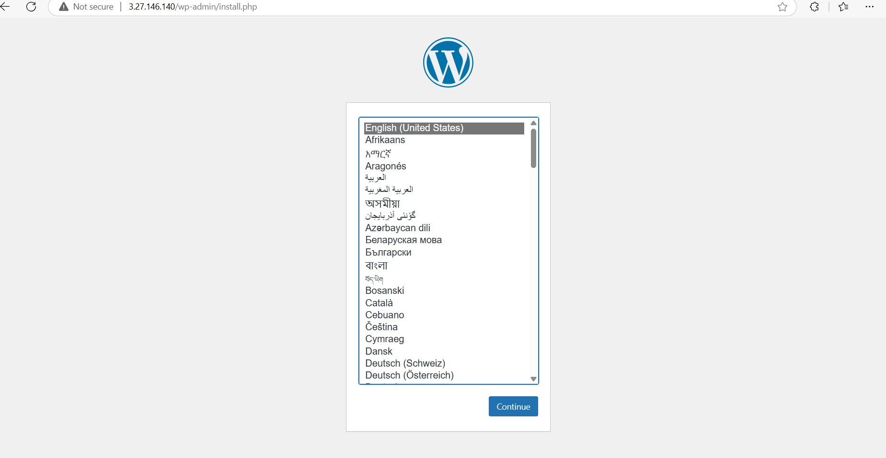
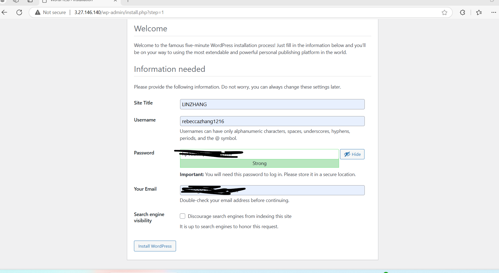
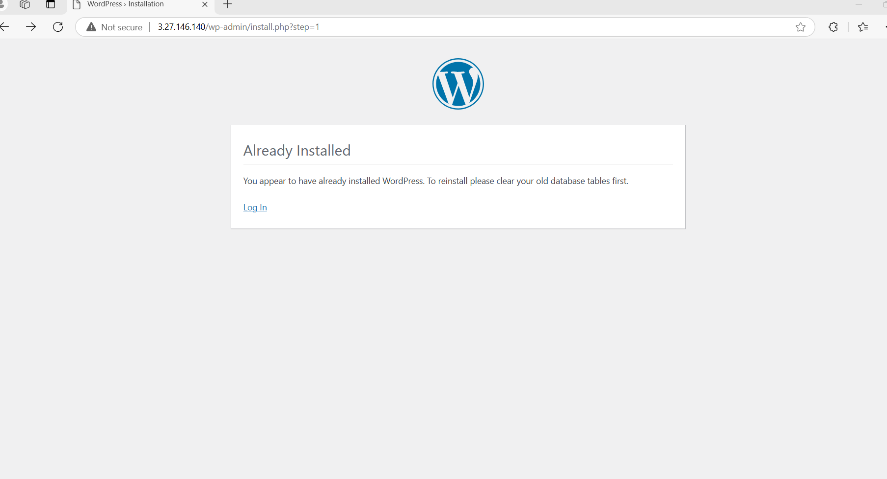
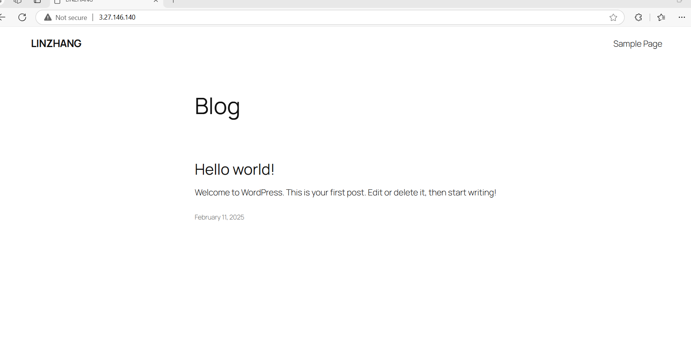

### Config Mysql
   

    
 
  

### login MySQL-Configure WordPress to connect to the database  

cat /srv/www/wordpress/wp-config.php refer to display the contents of the wp-config.php file located in the /srv/www/wordpress/ directory on a server.

database_name_,username,password replaced 

  

sudo -u www-data nano /srv/www/wordpress/wp-config.php open the config file in nano

  

delete the old ,and raplace the new content with salt

### config WordPress
  

  

  

