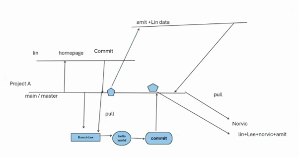
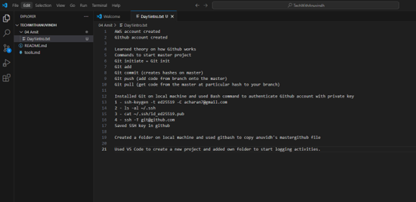
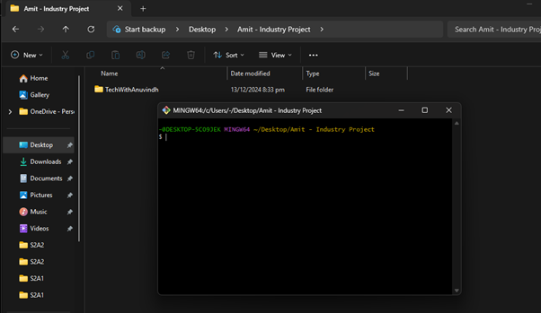

## **Progress and Activities** 

### **1. Accounts Created**  
- **AWS account created**  
- **GitHub account created**  

### **2. Learned Concepts**  
- **Theory on how GitHub works**  
    

- Commands to manage a master project:  
  - `git init` (initialize a Git repository)  
  - `git add` (stage changes for commit)  
  - `git commit` (creates hashes on the master branch)  
  - `git push` (add code from branch onto the master)  
  - `git pull` (get code from the master at a particular hash to your branch)  

### **3. Installed and Configured Git**  
- Installed Git on local machine.  
- Used Bash commands to authenticate GitHub account with a private key:  
  1. `ssh-keygen -t ed25519 -C ***@gmail.com`  
  2. `ls -al ~/.ssh`  
  3. `cat ~/.ssh/id_ed25519.pub`  
  4. `ssh -T git@github.com`  
- Saved the SSH key in GitHub.  

### **4. GitHub and Local Setup**  
    

- Created a folder on local machine.  
- Used Git Bash to copy Anuvindh's master GitHub file.  
    

### **5. New Project Setup**  
- Used **VS Code** to create a new project.  
- Added a personal folder to start logging activities.
